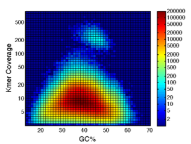

\newpage

# Whole Genome Assembly

{width="11in"}

**Fig. 1**---A distinct group of 6 Mbp, putative organellar sequences, are seen by plotting k-mer coverage vs GC content of the contigs of the whole genome assembly

|White Spruce PG29         | V2       | V3       |
|--------------------------|----------|----------|
|ABySS version             | 1.3.5    | 1.5.2    |
|Scaffolds ($\geq$ 500 bp) | 4.9 M    | 4.2 M    |
|Scaffold N50              | 20.4 kbp | 71.5 kbp |
|Largest scaffold          | 1.05 Mbp | 1.45 Mbp |

# Synopsis

+ The SMarTForests consortium published the draft sequence of the 20 gigabase white spruce genome (Birol *et al.* 2013)
+ Whole genome sequencing data contains reads from both the nuclear and organellar genomes
+ Reads of the organellar genomes are abundant, because each cell contains hundreds of mitochondria and plastids
+ One lane of MiSeq data assembles the 124 kbp plastid genome
+ One lane of HiSeq data assembles the estimated 6 Mbp mitochondrial genome
+ The assembly is composed of organellar sequence as well as nuclear repeat elements
+ The organellar sequences are separated from the assembly by classifying the sequences using their length, depth of coverage and GC content
+ The assembled organellar genomes were annotated for their coding genes, ribosomal RNA (rRNA), and transfer RNA (tRNA)

\newpage

# Plastid

{width="11in"}

**Fig. 2**---The complete plastid genome of white spruce. The PG29 white spruce chloroplast genome was annotated using MAKER and plotted using OrganellarGenomeDRAW (Lohse *et al.* 2007). The inner grey track depicts the GC content of the genome.

# Assembly Metrics

| Metric                          | Plastid         | Mitochondrion
|---------------------------------|-----------------|--------------
| Number of lanes                 | 1 MiSeq lane    | 1 HiSeq lane
| Number of read pairs            | 4.9 million     | 133 million
| Read length                     | 300 bp          | 150 bp
| Number of merged reads          | 3.0 million     | 1.4 million
| Median merged read length       | 492 bp          | 465 bp
| Number of assembled reads       | 21,000          | 377,000
| Proportion of organellar reads  | 1/140 or 0.7%   | 1/350 or 0.3%
| Depth of coverage               | 80x             | 30x
| Assembled genome size           | 123,266 bp      | 5.94 Mbp
| Number of contigs               | 1 contig        | 130 contigs
| Contig N50                      | 123 kbp         | 102 kbp
| Number of scaffolds             | 1 scaffold      | 36 scaffolds
| Scaffold N50                    | 123 kbp         | 369 kbp
| Largest scaffold                | 123 kbp         | 1222 kbp
| GC content                      | 38.8%           | 44.7%

\newpage

# Mitochondrion

{width="11in"}

**Fig. 3**---Relative order and size of genes on the scaffolds of the white spruce mitochondrial genome. Each box is proportional to the size of the gene including introns, except that genes smaller than 200 bp are shown as 200 bp. The space between genes is not to scale. An asterisk indicates that the gene name is truncated. Only scaffolds that harbor annotated genes are shown.

# Annotation Metrics

| Metric                          | Plastid         | Mitochondrion
|---------------------------------|-----------------|--------------
| Number of genes without ORFs    | 114 (108)       | 143 (74)
| Protein coding genes (mRNA)     | 74 (72)         | 106 (51)
| Ribosomal RNA genes (rRNA)      | 4 (4)           | 8 (3)
| Transfer RNA genes (tRNA)       | 36 (32)         | 29 (20)
| ORFs $\geq$ 300 bp              | Not available   | 1065
| Coding genes containing introns | 8               | 5
| Introns in coding genes         | 9               | 7
| tRNA genes containing introns   | 6               | 0

Note: The number of distinct genes is shown in parentheses.

{width="11in"}

\newpage

# Mitochondrial Gene Expression

{width="11in"}

**Fig. 4**---Transcript abundances of the mitochondrial genes were quantified in three developmental tissues and five mature tissues using data from RNA-seq experiments. Heatmap of the transcript abundance of mitochondrial protein-coding genes of white spruce. Each column is a tissue sample. Each row is a gene. Each cell represents the transcript abundance of one gene in one sample. The color scale is log10(TPM+1), where TPM is transcripts per million as measured by Salmon (Patro *et al.* 2014).

# C-to-U RNA Editing

+ C-to-U RNA editing was observed in the majority of mitochondrial genes
+ In four genes, editing events were noted to modify ACG codons to create cryptic AUG start codons

{width="11in"}

[\@sjackman](https://twitter.com/sjackman) --- <http://sjackman.ca>
